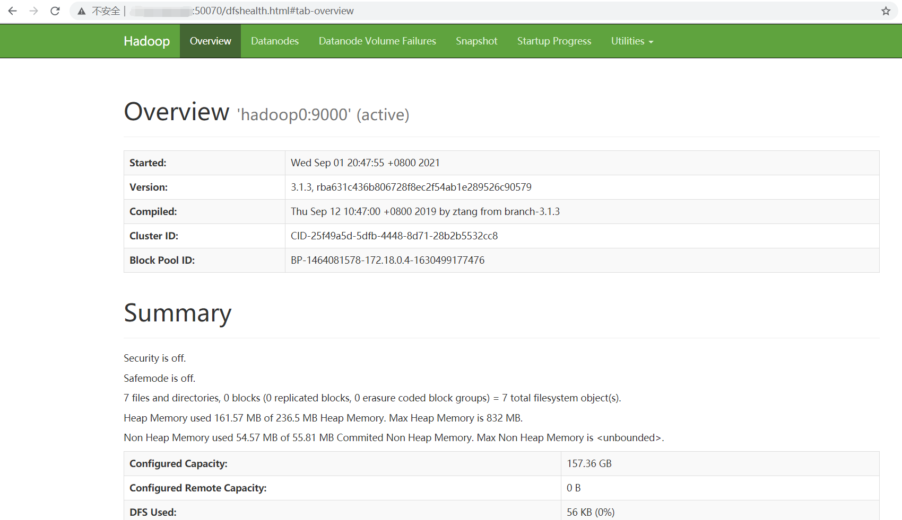
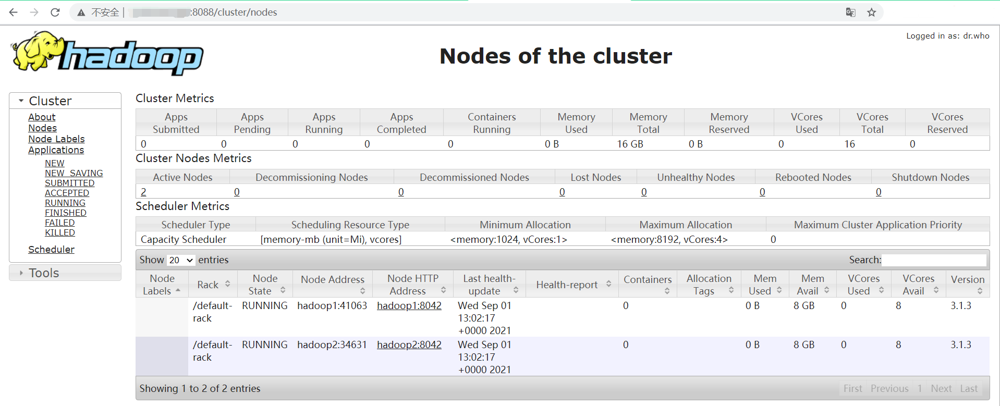

# docker搭建hadoop伪集群

## hadoop容器构建

- 安装基础镜像

``` shell
[root@abrahamvonghome hadoop]# cd centos_hdp/centos
[root@abrahamvonghome centos]# ls
Dockerfile
[root@abrahamvonghome centos]# docker build -t centos_base .
```

- 构建docker网络

``` shell
[root@abrahamvonghome centos]# docker network create -d bridge hadoop-network
6492905db88cda12c6310b4b4fddbceb1cc165a3d00c30cb808a63e6c9bf2820
[root@abrahamvonghome centos]# docker network ls
```

- 测试ssh

> 这个容器测试完可以删除

> ip从docker network中获取，把127.0.0.1换掉

``` shell
docker run --network=hadoop-network -itd --name=hadoop_ssh centos_base
[root@abrahamvonghome centos]# docker network inspect hadoop-network
[root@abrahamvonghome centos]# ssh 127.0.0.1 -l hadoop
The authenticity of host '127.0.0.1 (127.0.0.1)' can't be established.
RSA key fingerprint is SHA256:Cn2GNlhifrEQMGNVMyirMRmvpRi3X3h29f8hxu0FWuE.
Are you sure you want to continue connecting (yes/no/[fingerprint])? yes
Warning: Permanently added '127.0.0.1' (RSA) to the list of known hosts.
hadoop@127.0.0.1's password:
[hadoop@00a41ce3975e ~]$ cd /etc
[hadoop@00a41ce3975e etc]$ ls
BUILDTIME                crypttab       gnupg      kdump          makedumpfile.conf.sample  pkcs11     rc5.d           ssl                 terminfo
GREP_COLORS              csh.cshrc      group      kdump.conf     modprobe.d                pki        rc6.d           subgid              tmpfiles.d
NetworkManager           csh.login      group-     kernel         modules-load.d            pm         redhat-release  subgid-             udev
X11                      dbus-1         gshadow    krb5.conf      motd                      popt.d     resolv.conf     subuid              vconsole.conf
adjtime                  default        gshadow-   krb5.conf.d    mtab                      printcap   rpc             subuid-             virc
aliases                  depmod.d       gss        ld.so.cache    netconfig                 profile    rpm             sudo-ldap.conf      xattr.conf
alternatives             dhcp           host.conf  ld.so.conf     networks                  profile.d  sasl2           sudo.conf           xdg
bash_completion.d        dnf            hostname   ld.so.conf.d   nsswitch.conf             protocols  security        sudoers             xinetd.d
bashrc                   dracut.conf    hosts      libaudit.conf  nsswitch.conf.bak         rc.d       selinux         sudoers.d           yum
bindresvport.blacklist   dracut.conf.d  init.d     libreport      openldap                  rc.local   services        sysconfig           yum.conf
binfmt.d                 environment    inittab    locale.conf    opt                       rc0.d      shadow          sysctl.conf         yum.repos.d
centos-release           ethertypes     inputrc    localtime      os-release                rc1.d      shadow-         sysctl.d
centos-release-upstream  exports        iproute2   login.defs     pam.d                     rc2.d      shells          system-release
chkconfig.d              filesystems    issue      logrotate.d    passwd                    rc3.d      skel            system-release-cpe
crypto-policies          gcrypt         issue.net  machine-id     passwd-                   rc4.d      ssh             systemd
[hadoop@00a41ce3975e etc]$ exit
```

- 构建继承基础镜像并拥有hadoop环境的centos

``` shell
[root@abrahamvonghome centos_hdp]# docker build -t centos_hdp .
```

## 相互交换私钥

- 就centos_hdp镜像运行三个容器

``` shell
docker run --network hadoop-network --name hadoop621 --hostname hadoop1 -d -P centos_hdp
docker run --network hadoop-network --name hadoop620 --hostname hadoop2 -d -P centos_hdp
docker run --network hadoop-network --name hadoop618 --hostname hadoop0 -d -P -p 50070:50070 -p 8088:8088 centos_hdp

[root@abrahamvonghome centos_hdp]# docker ps
CONTAINER ID   IMAGE                      COMMAND                  CREATED              STATUS              PORTS                                                                                                                               NAMES
8674e0c4a407   centos_hdp                 "/usr/sbin/sshd -D"      43 seconds ago       Up 41 seconds       0.0.0.0:8088->8088/tcp, :::8088->8088/tcp, 0.0.0.0:50070->50070/tcp, :::50070->50070/tcp, 0.0.0.0:49155->22/tcp, :::49155->22/tcp   hadoop618
e24c7e3c8684   centos_hdp                 "/usr/sbin/sshd -D"      52 seconds ago       Up 51 seconds       0.0.0.0:49154->22/tcp, :::49154->22/tcp                                                                                             hadoop620
3783c12a1b2c   centos_hdp                 "/usr/sbin/sshd -D"      About a minute ago   Up About a minute   0.0.0.0:49153->22/tcp, :::49153->22/tcp                                                                                             hadoop621
```

> 我们最终希望能访问hadoop618转而控制hadoop620与hadoop621，因此把它的端口50070和8088暴露到外部网络

- 进入三个容器

``` shell
docker exec -it hadoop618 /bin/bash
docker exec -it hadoop620 /bin/bash
docker exec -it hadoop621 /bin/bash
```

- 都切换为hadoop用户

``` shell
su hadoop
```

- 都要生成私钥

``` shell
ssh-keygen
```

- 交换三个容器的登录私钥

> 自己对自己也要交换私钥

``` shell
ssh-copy-id -i ~/.ssh/id_rsa -p 22 hadoop@hadoop618
ssh-copy-id -i ~/.ssh/id_rsa -p 22 hadoop@hadoop620
ssh-copy-id -i ~/.ssh/id_rsa -p 22 hadoop@hadoop621 


[hadoop@hadoop0 /]$ ssh-copy-id -i ~/.ssh/id_rsa -p 22 hadoop@hadoop620
/usr/bin/ssh-copy-id: INFO: Source of key(s) to be installed: "/home/hadoop/.ssh/id_rsa.pub"
The authenticity of host 'hadoop620 (127.0.0.1)' can't be established.
RSA key fingerprint is SHA256:Cn2GNlhifrEQMGNVMyirMRmvpRi3X3h29f8hxu0FWuE.
Are you sure you want to continue connecting (yes/no/[fingerprint])? yes
/usr/bin/ssh-copy-id: INFO: attempting to log in with the new key(s), to filter out any that are already installed
/usr/bin/ssh-copy-id: INFO: 1 key(s) remain to be installed -- if you are prompted now it is to install the new keys
hadoop@hadoop620's password:

Number of key(s) added: 1

Now try logging into the machine, with:   "ssh -p '22' 'hadoop@hadoop620'"
and check to make sure that only the key(s) you wanted were added.

[hadoop@hadoop0 /]$ ssh -p '22' 'hadoop@hadoop620'
[hadoop@hadoop2 ~]$ exit
logout
Connection to hadoop620 closed.
```

## 四大基本配置

- 进入hadoop618修改配置

``` shell
[root@hadoop0 /]# vi /usr/local/hadoop/etc/hadoop/core-site.xml
```

``` xml
<configuration>
    <property>
        <name>fs.default.name</name>
        <value>hdfs://hadoop0:9000</value>
    </property>
    <property>
        <name>io.file.buffer.size</name>
        <value>131072</value>
    </property>
    <property>
        <name>hadoop.tmp.dir</name>
        <value>file:/home/hadoop/tmp</value>
        <description>A base for other temporary directories.</description>
    </property>
    <property>
        <name>hadoop.proxyuser.hduser.hosts</name>
        <value>*</value>
    </property>
    <property>
        <name>hadoop.proxyuser.hduser.groups</name>
        <value>*</value>
    </property>
   <property>
       <name>fs.trash.interval</name>
       <value>1440</value>
   </property>
</configuration>
```

``` shell
[root@hadoop0 /]# vi /usr/local/hadoop/etc/hadoop/hdfs-site.xml
```

``` xml
<configuration>
    <property>
        <name>dfs.namenode.name.dir</name>
        <value>file:/usr/local/hadoop/hdfs/name</value>
     </property>
     <property>
        <name>dfs.datanode.data.dir</name>
        <value>file:/usr/local/hadoop/hdfs/data</value>
     </property>
     <property>
        <name>dfs.replication</name>
        <value>2</value>
     </property>
     <property>
       <name>dfs.http.address</name>
       <value>0.0.0.0:50070</value>
     </property>
     <property>
        <name>dfs.namenode.secondary.http-address</name>
        <value>hadoop0:9001</value>
     </property>
     <property>
        <name>dfs.webhdfs.enabled</name>
        <value>true</value>
     </property>
</configuration>
```

``` shell
[root@hadoop0 /]# vi /usr/local/hadoop/etc/hadoop/mapred-site.xml
```

``` xml
<configuration>
     <property>
        <name>mapreduce.framework.name</name>
        <value>yarn</value>
    </property>
    <property>
        <name>mapreduce.jobhistory.address</name>
        <value>hadoop0:10020</value>
    </property>
    <property>
        <name>mapreduce.jobhistory.webapp.address</name>
        <value>hadoop0:19888</value>
    </property>
</configuration>
```

``` shell
[root@hadoop0 /]# vi /usr/local/hadoop/etc/hadoop/yarn-site.xml
```

``` xml
<configuration>
    <property>
        <name>yarn.nodemanager.aux-services</name>
        <value>mapreduce_shuffle</value>
    </property>
    <property>
        <name>yarn.nodemanager.auxservices.mapreduce.shuffle.class</name>
        <value>org.apache.hadoop.mapred.ShuffleHandler</value>
    </property>
    <property>
        <name>yarn.resourcemanager.address</name>
        <value>hadoop0:8032</value>
    </property>
    <property>
        <name>yarn.resourcemanager.scheduler.address</name>
        <value>hadoop0:8030</value>
    </property>
    <property>
        <name>yarn.resourcemanager.resource-tracker.address</name>
        <value>hadoop0:8031</value>
    </property>
    <property>
        <name>yarn.resourcemanager.admin.address</name>
        <value>hadoop0:8033</value>
    </property>
    <property>
        <name>yarn.resourcemanager.webapp.address</name>
        <value>hadoop0:8088</value>
    </property>
</configuration>
```

## 同步所有配置

- 设置从机

> 3版本以上才是改workers，2版本并不是

``` shell
[root@hadoop0 /]# vi /usr/local/hadoop/etc/hadoop/workers
hadoop1
hadoop2
```

- 给hadoop增加jdk环境变量

``` shell
[root@hadoop0 /]# vi /usr/local/hadoop/etc/hadoop/hadoop-env.sh
export JAVA_HOME=/usr/local/jdk1.8
```

- 618将修改过后的hadoop文件发送给hadoop620和hadoop621容器

``` shell
[root@hadoop0 hadoop]# su hadoop
[hadoop@hadoop0 hadoop]$ scp -r /usr/local/hadoop hadoop@hadoop620:/tmp
[hadoop@hadoop0 hadoop]$ scp -r /usr/local/hadoop hadoop@hadoop621:/tmp
```

- 进入hadoop620和hadoop621删除原来的hadoop文件

``` shell
[root@hadoop2 /]# rm -rf /usr/local/hadoop
[root@hadoop2 /]# cp -rf /tmp/hadoop /usr/local/hadoop
```

- 三个容器中都要增加Hadoop环境变量

``` shell
[root@hadoop2 /]# vi ~/.bashrc

# hadoop
export PATH=$PATH:/usr/local/hadoop/bin:/usr/local/hadoop/sbin

[root@hadoop2 /]# source ~/.bashrc
```

- 三个容器都要提升hadoop对hadoop文件夹权限

``` shell
[root@hadoop0 /]# chown -R hadoop /usr/local/hadoop/
[root@hadoop2 /]# chown -R hadoop /usr/local/hadoop/
[root@hadoop1 /]# chown -R hadoop /usr/local/hadoop/
```

## 准备启动

- 对于start-dfs.sh和stop-dfs.sh文件，添加下列参数：

> 直接启动成功就不必须

``` shell
#!/usr/bin/env bash
HDFS_DATANODE_USER=root
HADOOP_SECURE_DN_USER=hdfs
HDFS_NAMENODE_USER=root
HDFS_SECONDARYNAMENODE_USER=root
```

- 对于start-yarn.sh和stop-yarn.sh文件，添加下列参数：

> 直接启动成功就不必须

``` shell
#!/usr/bin/env bash
YARN_RESOURCEMANAGER_USER=root
HADOOP_SECURE_DN_USER=yarn
YARN_NODEMANAGER_USER=root
```

- 最后切换hadoop用户启动hdfs和yarn

``` bash
[root@hadoop0 sbin]$ su hadoop
[hadoop@hadoop0 sbin]$ start-dfs.sh
WARNING: HADOOP_SECURE_DN_USER has been replaced by HDFS_DATANODE_SECURE_USER. Using value of HADOOP_SECURE_DN_USER.
Starting namenodes on [hadoop0]
hadoop0: WARNING: /usr/local/hadoop/logs does not exist. Creating.
Starting datanodes
Starting secondary namenodes [hadoop0]
[hadoop@hadoop0 sbin]$ start-yarn.sh
Starting resourcemanager
Starting nodemanagers
```

- 再加historyserver

``` shell
mr-jobhistory-daemon.sh start historyserver
hadoop dfsadmin -report
```

- 格式化

``` bash
hdfs namenode–format 
hadoop namenode –format
```

## 测试

- hfds打开http://localhost:50070



- yarn打开http://localhost:8088



- 创建一个文件试试

``` shell
hdfs dfs -mkdir -p /home/hadoop/input
```

> 云服务器运行内存使用情况（包括centos容器）：2379MB = 2.37G

> 2核4G服务器运行占比：64%

> 1核2G还是别玩伪集群吧
